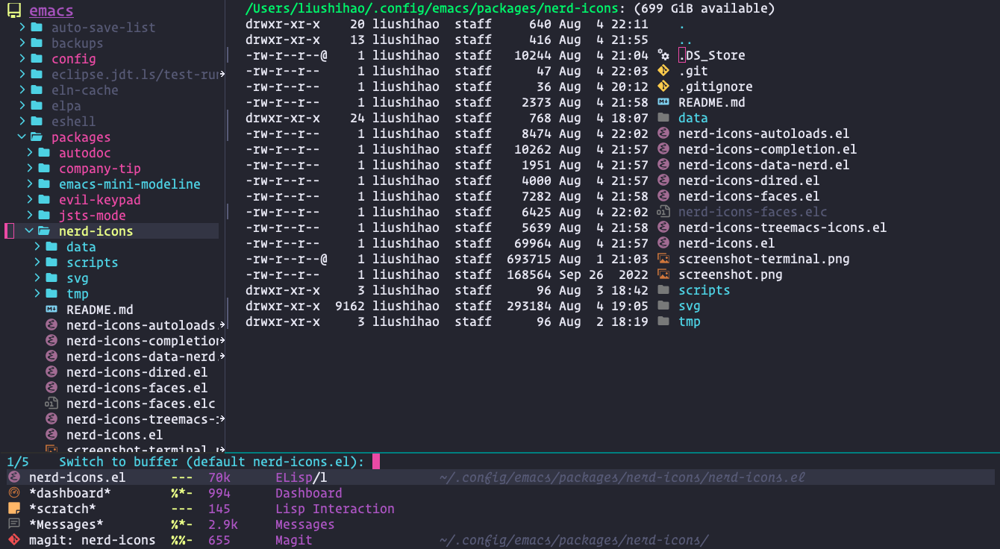
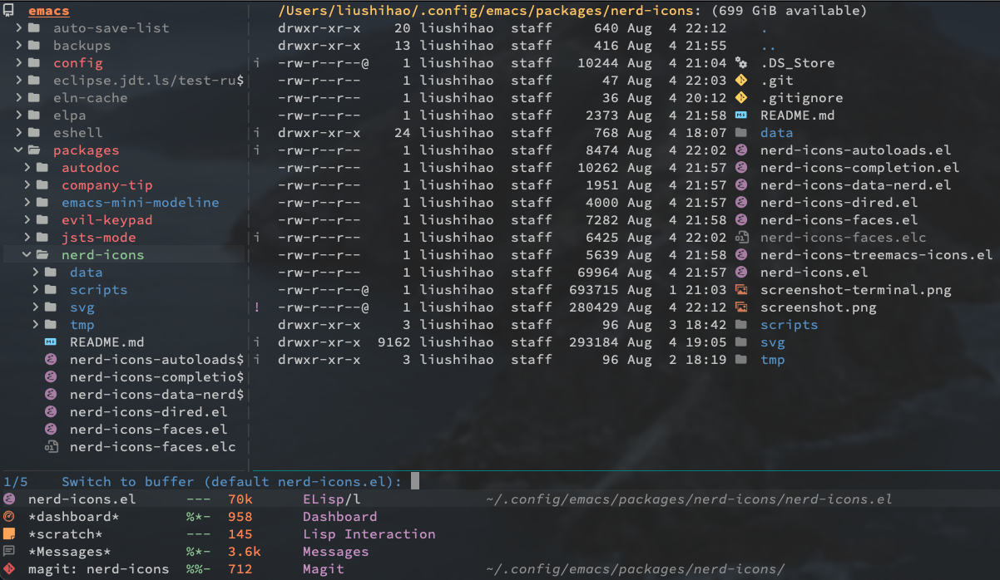

# nerd-svg-icons for Emacs
## GUI Emacs:


## Terminal Emacs (on macOS Terminal.app):


nerd-svg-icons makes inserting icons in Emacs graceful and painless. It uses SVG icons in GUI Emacs and [Nerd font](https://www.nerdfonts.com/) icons in Terminal Emacs.

It is partially meant as an alternative to [`all-the-icons`](https://github.com/domtronn/all-the-icons.el) to provide better looking and experience.

## Main features

1. Perfect alignment. The SVG icons are perfectly aligned both horizontally and vertically.
2. Supports both GUI and Terminal Emacs.
3. (Additionally) provides icon support for several use cases, including [`Treemacs`](https://github.com/Alexander-Miller/treemacs), `Dired`, and minibuffer completion.
4. Caching mechanism. The SVG icons are cached so as to save memory and speed up performance.

## Prerequisites

1. In order display icons properly in terminal Emacs, Nerd-patch font is required (checkout [Nerd font website](https://www.nerdfonts.com/)).
2. In order display icons properly in GUI Emacs, Emacs SVG support is required, which can be checked with
   
   ``` elisp
   (image-type-available-p 'svg)
   ```

## Getting started

First, clone the repo:

``` shell
git clone --depth=1 https://github.com/liushihao456/nerd-svg-icons.git
```

Then load it:

``` elisp
(add-to-list 'load-path "/path/to/nerd-svg-icons/")

;; Minibuffer completion icons
(require 'nerd-svg-icons-completion)
(nerd-svg-icons-completion-mode t)

;; Dired icons
(require 'nerd-svg-icons-dired)
(add-hook 'dired-mode-hook 'nerd-svg-icons-dired-mode)

;; Treemacs icons
(require 'nerd-svg-icons-treemacs-icons)
(nerd-svg-icons-treemacs-icons-config)

;; Ibuffer icons
(add-hook 'ibuffer-hook #'nerd-svg-icons-ibuffer-mode)
```

## Basic usage

To get an icon as str, just evaluate (for example):

``` elisp
(nerd-svg-icons-icon-str "oct-repo")
;; or
(nerd-svg-icons-icon-str "oct-repo" :face 'nerd-svg-icons-orange :scale 1.2)
```

It will return a string containing the icon that can be inserted.

## Acknowledgements

This package is inspired largely by these excellent projects:

* [`all-the-icons`](https://github.com/domtronn/all-the-icons.el)
* [`all-the-icons-dired`](https://github.com/jtbm37/all-the-icons-dired)
* [`all-the-icons-completion`](https://github.com/iyefrat/all-the-icons-completion)
* [`doom-themes-treemacs`](https://github.com/doomemacs/themes)
* [`emacs-svg-icon`](https://github.com/rougier/emacs-svg-icon)
* [`nerd-icons.el`](https://github.com/rainstormstudio/nerd-icons.el)

